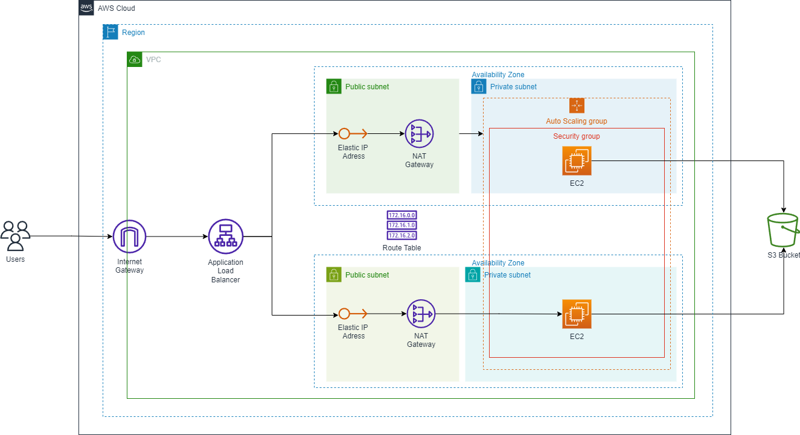

# Deploy a high-availability web app using CloudFormation
## Table of Contents

* [Project Scenario](#project-scenario)
* [Solution](#solution)
* [Result](#result)

## Project Scenario

Your company is creating an Instagram clone called Udagram, and the requirement is to deploy this new application to the AWS infrastructure using Infrastructure as Code.

You have been tasked with provisioning the required infrastructure and deploying a dummy application, along with the necessary supporting software.

Since the underlying network infrastructure will be maintained by a separate team, you must create independent stacks for the network infrastructure and the application itself.

Infrastructure spin up and tear down needs to be automated so that each team can create and discard testing environments on demand.

## Solution

Considering the project guidelines and the project rubric, I have developed the following infrastructure diagram for the deployment of Udagram Application:



### Creating the Network Stack
```zsh
./create.sh udagram-network network.yml network-parameters.json
```

### Updating the Network Stack
```zsh
./update.sh udagram-network network.yml network-parameters.json
```
### Deleting the Network Stack
```zsh
./delete.sh udagram-network
```

### Creating the Server Stack
```zsh
./create.sh udagram-server udagram.yml udagram-parameters.json
```

### Updating the Server Stack
```zsh
./update.sh udagram-server udagram.yml udagram-parameters.json
```

### Deleting the Server Stack
```zsh
./delete.sh udagram-server
```

## Result

